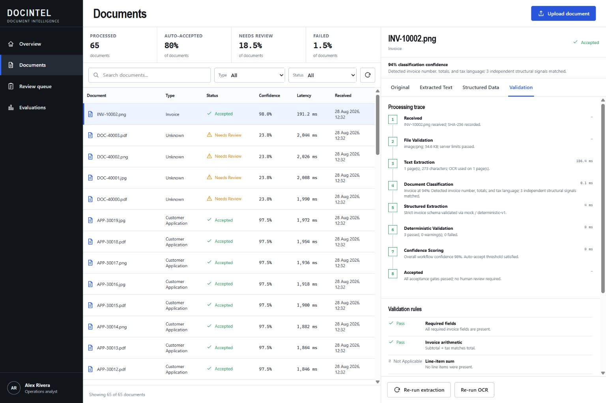

# Engineering Portfolio

A collection of production-oriented software and AI engineering projects. Each project lives in its own self-contained directory with source code, tests, documentation, and local setup instructions.

## Projects

### [Nexora AI Operations Platform](nexora-ai-operations-platform)

An AI operations platform for retrieval-augmented generation, explainable model routing, controlled tool execution, human review, observability, and repeatable LLM evaluation.

[](nexora-ai-operations-platform)

**Stack:** FastAPI, React, TypeScript, PostgreSQL, pgvector, Docker Compose

**Highlights:** grounded RAG, risk-aware routing, schema-validated tools, review workflows, trace-level telemetry, typed document routing with native/OCR invoice extraction, plus checked-in 40-case regression and 30-case held-out evaluation evidence.

### [Document Intelligence Pipeline](document-intelligence-pipeline)

A document operations workbench for hybrid PDF/OCR extraction, strict structured output, deterministic business validation, explainable confidence, human review, and reproducible evaluation.

[](document-intelligence-pipeline)

**Stack:** FastAPI, React, TypeScript, PostgreSQL, SQLAlchemy, PyMuPDF, Tesseract, Docker Compose

**Highlights:** native PDF extraction with per-page OCR fallback, invoice/statement/application schemas, rule-level validation, confidence-based routing, in-app source preview, audited edit-and-approve workflow, a checked-in 64-file synthetic corpus, and baseline/improved evaluation across ten metrics.

## Repository structure

```text
portfolio/
├── nexora-ai-operations-platform/
    ├── backend/
    ├── frontend/
    ├── docs/
    │   ├── api.md
    │   ├── architecture.md
    │   ├── evaluation.md
    │   └── security.md
    ├── docker-compose.yml
    └── README.md
└── document-intelligence-pipeline/
    ├── backend/
    ├── frontend/
    ├── data/
    ├── docs/
    ├── scripts/
    ├── docker-compose.yml
    └── README.md
```

Open a project directory for its complete documentation and startup instructions.
