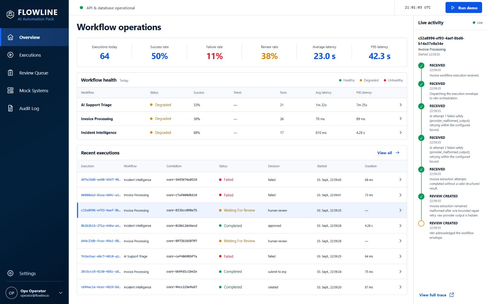

# Flowline — AI Automation Orchestration

An operations console for end-to-end AI automations: support triage, invoice processing, and incident management with human approval gates.



**What it demonstrates:** Real-world AI workflow orchestration — not just AI calls, but complete business processes with error handling, approvals, and audit trails.

---

## Key Features

- **AI Support Triage** — classifies tickets, retrieves knowledge, drafts responses
- **Invoice Processing** — extracts data, validates arithmetic, detects duplicates
- **Incident Management** — deduplicates alerts, creates Jira issues, notifies teams
- **Human Approval Gates** — sensitive operations require human sign-off
- **Complete Audit Trail** — every decision, retry, and action is logged
- **Error Handling** — failures are visible, not hidden

---

## Workflows

### Support Triage
```
Ticket → Validate → Classify Risk → Retrieve Knowledge → Draft Response
                                                        ↓
                              High Risk? → Human Review → Send to CRM
                                                        ↓
                              Low Risk? → Auto-Send to CRM
```

### Invoice Processing
```
Invoice → Extract Fields → Validate Arithmetic → Check Duplicates
                                                     ↓
                          Valid? → Submit to ERP → Done
                                                     ↓
                          Invalid? → Human Review
```

### Incident Management
```
Alert → Validate → Deduplicate → Create Summary → Create Jira
                                                  ↓
                          Low Confidence? → Human Approval
                                                  ↓
                          High Confidence? → Auto-Create
```

---

## Key Competencies Demonstrated

| Skill | Evidence |
|-------|----------|
| Integration design | FastAPI ↔ n8n orchestration boundary |
| Data validation | Invoice arithmetic, duplicate detection |
| Risk management | Human approval for sensitive actions |
| Error handling | Bounded retries, visible failures |
| Observability | Full execution timeline, metrics |

---

## Quick Start

```powershell
.\manage.ps1 Setup
.\manage.ps1 Up
.\manage.ps1 Seed
.\manage.ps1 Demo
```

- UI: http://localhost:3004
- n8n Editor: http://localhost:5678

---

## Architecture

```
React UI → FastAPI (public) → n8n orchestration
                                    ↓
                            FastAPI (domain)
                                    ↓
                    AI Provider → Validation → Policies
                                    ↓
                            PostgreSQL persistence
```

**Stack:** n8n · FastAPI · React · TypeScript · PostgreSQL · SQLAlchemy · Docker

---

## License

MIT
