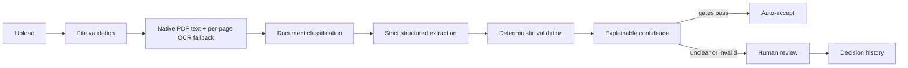

# DocIntel — Document Intelligence Pipeline

DocIntel is a production-oriented document operations demo for hybrid PDF/OCR
extraction, strict structured output, deterministic validation, explainable
confidence, human review, and reproducible ground-truth evaluation.


The repository contains only synthetic data. `mock` mode is the default, so the
complete application and evaluation suite run without network access or paid
model calls. An OpenAI-compatible provider can be enabled at runtime without
putting credentials in the frontend or Git.

## Product flow



Supported schemas:

- Invoice — parties, date, currency, subtotal, tax, total, and line items.
- Bank statement — period, balances, masked IBAN, and transactions.
- Customer application — identity, contact details, country, and product.
- Unknown documents — routed to review without forcing an incorrect schema.

## What the demo covers

- Named, timed pipeline stages with success, warning, failure, and skipped states.
- Streaming 10 MB upload limit, signature/MIME checks, sanitized filenames, and SHA-256.
- PyMuPDF native extraction with OCR only for low-density pages; Pillow and local Tesseract for images.
- OpenAI-compatible structured output with Pydantic v2 schemas, one repair attempt, timeout/retry, and deterministic fallback.
- Rule-level invoice arithmetic, line sums, statement periods/balances, email, and phone validation.
- Confidence components and weights shown as a workflow heuristic—not probability.
- Newest-first review queue with approve, edit-and-approve, reject, retry, and OCR rerun.
- Versioned 64-file synthetic corpus: 20 invoices, 20 statements, 20 applications, and 4 unknown documents.
- Baseline vs Improved evaluation with stable selected-run persistence in the UI.
- Actual numeric dashboard metrics with units and definitions.

## Architecture

```text
React + TypeScript + Vite
        │ /api/v1
        ▼
FastAPI ── upload guard ── pipeline orchestration ── provider adapters
        │                         │                        │
        │                         ├─ PyMuPDF / Tesseract   ├─ deterministic mock
        │                         ├─ Pydantic schemas      └─ OpenAI compatible
        │                         ├─ validation rules
        │                         └─ confidence / review
        ▼
SQLAlchemy 2.x ── PostgreSQL 16 (Compose) / SQLite (tests)
        │
        └─ original files + versioned ground truth + evaluation artifacts
```

See [architecture](docs/architecture.md), [evaluation methodology](docs/evaluation.md),
and [security notes](docs/security.md).

## Quick start

Requirements: Docker Desktop or Docker Engine with Compose v2.24+ and at least
4 GB of available memory.

```powershell
Copy-Item .env.example .env
# Replace POSTGRES_PASSWORD in .env with a long URL-safe local value.
docker compose up --build -d
Invoke-RestMethod http://localhost:3001/api/v1/health
```

- Operator UI: <http://localhost:3001>
- OpenAPI: <http://localhost:3001/api/v1/docs>
- Health: <http://localhost:3001/api/v1/health>

The checked-in corpus is ready to seed automatically. To regenerate it and
reset demo state:

```powershell
.\manage.ps1 Seed
```

## Optional OpenAI provider

Keep the default `DOCINTEL_PROVIDER_MODE=mock` for deterministic offline use.
For OpenAI, use the ignored repository-root `.env.local`:

```dotenv
OPENAI_API_KEY=<local runtime secret>
DOCINTEL_PROVIDER_MODE=openai
DOCINTEL_OPENAI_BASE_URL=https://api.openai.com/v1
DOCINTEL_OPENAI_MODEL=gpt-4.1-mini
```

Restart the backend after changing provider configuration. Documents are
treated as untrusted data in the provider prompt; credentials never enter the
browser bundle, API responses, logs, screenshots, or source control.

## Actual synthetic benchmark

The values below were produced by the checked-in deterministic evaluation over
the 60 supported ground-truth documents. They are regression evidence for this
synthetic corpus, not production accuracy claims.

| Metric | Baseline | Improved | Delta |
|---|---:|---:|---:|
| Classification accuracy | 93.3% | 98.3% | +5.0 pp |
| Required-field recall | 92.5% | 98.9% | +6.4 pp |
| Field exact match | 94.8% | 99.4% | +4.6 pp |
| Numeric accuracy | 94.4% | 98.8% | +4.4 pp |
| Structured-output success | 96.7% | 98.3% | +1.6 pp |
| Validation detection rate | 88.9% | 100.0% | +11.1 pp |
| Review-routing accuracy | 95.0% | 98.3% | +3.3 pp |
| Average latency | 1,533.2 ms | 1,203.2 ms | −330.0 ms |
| p95 latency | 2,069.0 ms | 1,746.4 ms | −322.6 ms |
| Estimated cost / document | $0.0000 | $0.0042 | +$0.0042 |

Latency and cost deltas use the correct lower-is-better interpretation. The UI
explains the exact configuration difference and surfaces remaining failures.

## Verification

```powershell
.\manage.ps1 Test
.\manage.ps1 Frontend
.\manage.ps1 Config
```

The backend suite covers upload enforcement, signature checking, native text,
OCR abstraction, classification, malformed structured output repair, schema and
business validation, confidence, review routing, and evaluation math. Frontend
tests cover navigation, actual metric rendering, and evaluation selection
persistence.

## Failure modes

- Oversized or mismatched uploads return explicit 4xx responses and do not create partial records.
- Native extraction failure triggers OCR per page; OCR failure stops dependent stages and marks them skipped.
- Provider timeouts or malformed output use bounded retry/repair and deterministic fallback where configured.
- Unsupported document types enter review without fabricated structured fields.
- Strict schema or deterministic rule failures preserve evidence and exact review reasons.

## Deployment boundary

This is a portfolio-grade local system, not a public multi-tenant service.
Before public deployment add authentication/authorization, malware scanning,
encrypted object storage, durable jobs, per-tenant isolation, audit retention,
central secret management, backups, and penetration testing.

## License

MIT. See [LICENSE](LICENSE).
