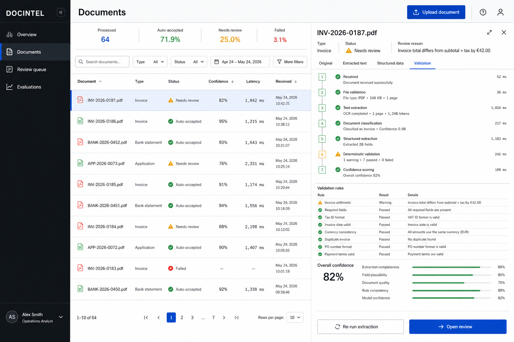

# DocIntel - Document Processing & Validation

A platform for extracting structured data from documents (invoices, statements, applications) with business validation and human review workflows.



**What it demonstrates:** End-to-end document AI pipeline - from upload to validated structured data, with explainable confidence scoring.

---

## Key Features

- **Multi-format support** - PDF, PNG, JPG with automatic OCR fallback
- **Document classification** - identifies invoice, bank statement, or application type
- **Structured extraction** - pulls specific fields with Pydantic validation
- **Business rules** - validates totals, dates, required fields
- **Confidence scoring** - shows exactly why a document needs review
- **Human review queue** - approve, reject, or edit before final decision
- **64 test documents** with measurable accuracy metrics

---

## How It Works

```
Upload → Validate → Extract Text → Classify → Extract Fields
                                                  ↓
                                    Business Rules + Confidence
                                                  ↓
                              Auto-Accept OR Human Review → Audit
```

---

## Measured Results

| Metric | Result |
|--------|--------|
| Classification accuracy | 98.3% |
| Field extraction accuracy | 99.4% |
| Validation detection rate | 100% |
| Auto-accept rate | Configurable |

---

## Quick Start

```powershell
.\manage.ps1 Setup
.\manage.ps1 Up
.\manage.ps1 Seed  # Load demo documents
```

- UI: http://localhost:3001
- API: http://localhost:3001/api/v1/docs

---

## Architecture

```
React/Vite UI → FastAPI → PostgreSQL
                     ↓
            Upload Guard → OCR/Text Extraction
                     ↓
            Classification → Structured Extraction
                     ↓
            Validation Rules → Confidence Scoring
                     ↓
            Auto-Accept OR Review Queue
```

**Stack:** FastAPI · React · TypeScript · PyMuPDF · Tesseract · Pydantic v2 · PostgreSQL · Docker

---

## License

MIT
