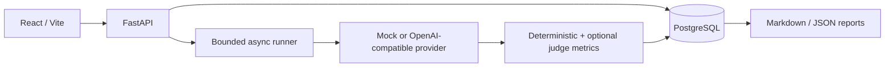

# EvalForge

Reproducible evaluation platform for LLMs, prompts and RAG pipelines with quality, hallucination, latency, cost and regression analysis.


EvalForge is a working AI-engineering lab, not a score mockup. It expands exact model × prompt × retrieval × case matrices, runs them asynchronously, persists partial results, and lets an engineer explain both aggregate change and individual regressions. The deterministic mock provider is default, so the complete demo is measurable without paid API calls.

## Measured demonstration result

This table was generated from the persisted 224-generation seed run on 28 August 2026. The benchmark compares the first and last immutable configuration snapshots. It is synthetic regression evidence, not a production-quality claim.

| Metric | Mock Standard + prompt v1.0.0 | Mock Candidate + prompt v2.1.0 | Delta | Better direction | n |
|---|---:|---:|---:|---|---:|
| Normalized exact match | 68.75% | 87.50% | +18.75 pp | higher | 48 |
| Keyword recall | 87.35% | 98.51% | +11.16 pp | higher | 56 |
| Forbidden claim rate | 0.00% | 5.36% | +5.36 pp regression | lower | 56 |
| p95 latency | 98.0 ms | 66.0 ms | -32.0 ms improvement | lower | 56 |
| Estimated cost | $0.001260 | $0.002123 | +$0.000863 regression | lower | 56 |
| Groundedness (mock LLM judge) | 4.09 / 5 | 4.49 / 5 | +0.40 | higher | 56 |

Pairwise case analysis found **14 improved, 39 unchanged, and 3 regressed** cases. The candidate improves aggregate exact match and recall while introducing three forbidden-claim regressions; EvalForge keeps all three visible.

## What the demo covers

- 56 checked-in synthetic JSONL cases across factual QA, missing information, grounded QA, summarization, extraction, structured output, and adversarial prompt injection.
- Model, prompt, retrieval and experiment registries with an exact workload preview and duplicate-start protection.
- Deterministic mock, intentionally flaky mock, OpenAI-compatible, and AI Prime Tech-compatible provider adapters.
- Async bounded batches, retries with backoff, timeouts, cancellation, incremental persistence, progress, ETA, and stale-run recovery.
- Deterministic quality/safety/RAG metrics, operational latency/token/cost metrics, and a separately marked structured judge.
- Pairwise improved/unchanged/regressed classification and a filterable evidence inspector.
- RAG top-3, top-5 and reranked top-5 configurations with rank, relevance score, source ID, and expected-source hit/miss.
- Real Markdown and JSON reports built from persisted results.
- Historical run URLs that survive polling, refresh, and browser back/forward navigation.

## Quick run

Requirements: Docker Desktop or Docker Engine with Compose v2.24+.

```powershell
.\manage.ps1 Setup
# Replace POSTGRES_PASSWORD before any shared deployment.
.\manage.ps1 Up
Invoke-RestMethod http://localhost:3003/api/v1/health
```

- Evaluation UI: <http://localhost:3003>
- API schema: <http://localhost:3003/api/v1/docs>
- Direct API: <http://localhost:8003/api/v1/health>

The first startup seeds three measured runs: a 224-generation model/prompt comparison, a 56-generation partial-provider-failure drill, and a 168-generation RAG sweep. No hand-authored score is inserted into the database.

Run verification:

```powershell
.\manage.ps1 Test
.\manage.ps1 Frontend
.\manage.ps1 Config
```

## Architecture



See [architecture](docs/architecture.md) for component boundaries and recovery behavior, [evaluation](docs/evaluation.md) for metric definitions, [API notes](docs/api.md) for contracts, and [security](docs/security.md) for the credential/deployment boundary.

## Deterministic metrics vs judge metrics

Deterministic metrics execute in code against explicit references, keywords, forbidden claims, schemas, citations and retrieved source IDs. Judge metrics use a stored structured schema with correctness, groundedness, relevance and reason. They are visually labelled “LLM judge,” include the judge model/prompt/latency/cost/raw result, and are not treated as ground truth.

## Reproducibility and configuration snapshots

Every run stores a deep immutable snapshot containing dataset version/hash/cases; full model generation parameters and pricing; full prompt text/version; retrieval mode/chunk/overlap/top-k/reranker/embedding model; evaluator settings; git commit when available; timestamp; and the expanded configuration keys. Historical result columns always expose “View configuration.”

The selected run is encoded as `/runs/{run_id}`. Polling fetches only that ID. A missing run shows an explicit message and is never silently replaced by the newest run.

## Delta semantics

- Rates: percentage points.
- Latency: milliseconds plus relative percent.
- Cost: USD plus relative percent.
- Counts: absolute values.

The metric definition supplies the better direction. Therefore `-32 ms` is an improvement, while `+$0.000863` is a regression. Color is derived from semantics, never from the numeric sign alone.

## Failure analysis and cost tracking

The failure explorer exposes input, reference, context, exact model output, failed metrics and their definitions, judge notes, latency, cost, retry count, provider error, and retrieved chunks. Filters cover model, prompt, retrieval configuration, category, failure type, and regressions only.

Cost is calculated per call from actual reported/mock token usage and the immutable per-million-token prices. If usage or price is unavailable, the UI and reports say `unavailable`; they never infer a value.

## Repository map

```text
backend/      FastAPI, SQLAlchemy entities, providers, runner, metrics, reports, tests
frontend/     React/Vite application, Recharts operational chart, UI tests
data/         56-case JSONL benchmark
docs/         Architecture, evaluation, API, security and visual design references
```

## License

MIT. See [LICENSE](LICENSE).
