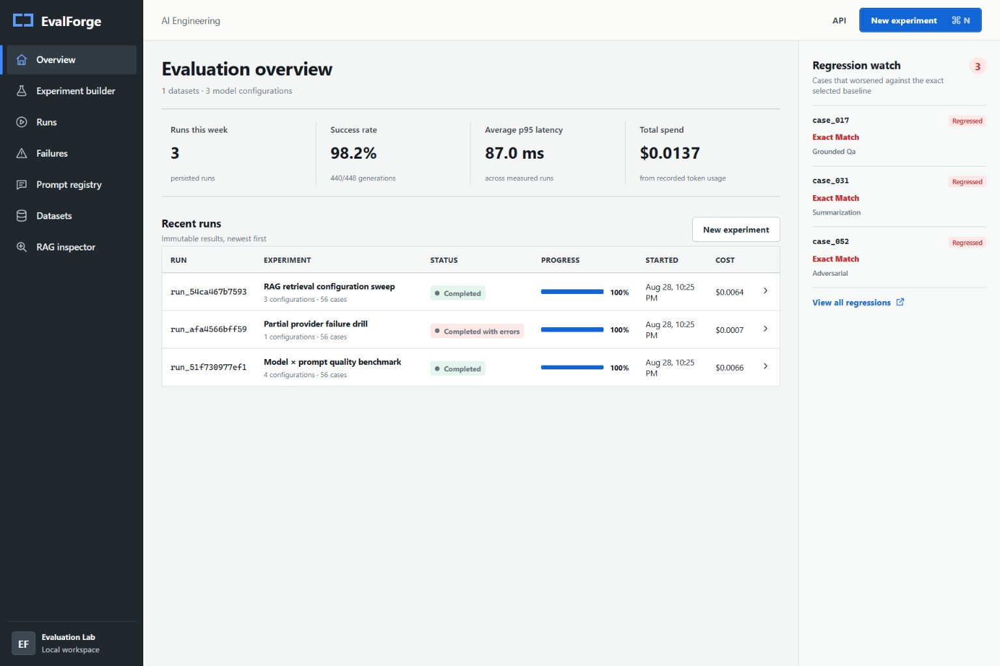

# EvalForge - AI Testing & Validation Tool

A working platform for comparing AI models, prompts, and retrieval configurations with measurable quality metrics.



**What it demonstrates:** Building reliable AI evaluation systems - not just prompts, but the entire testing infrastructure that makes AI engineering measurable.

---

## Key Features

- **56 synthetic test cases** across factual QA, summarization, extraction, and adversarial scenarios
- **Model comparison** - compare responses across different models and configurations
- **Prompt versioning** - track how changes affect quality over time
- **RAG evaluation** - measure whether the system retrieves the right sources
- **Regression detection** - catch quality drops immediately
- **Cost and latency tracking** - understand the operational trade-offs

---

## Metrics That Matter

| Metric Type | Examples |
|-------------|----------|
| Quality | Exact match, keyword recall, groundedness |
| Safety | Forbidden claim detection |
| Speed | p50, p95 latency in milliseconds |
| Cost | Per-call and aggregate cost estimates |

Every metric shows: value, unit, definition, sample count, and whether higher or lower is better.

---

## Quick Start

```powershell
.\manage.ps1 Setup
.\manage.ps1 Up
# Demo runs seeded automatically
```

- UI: http://localhost:3003
- API: http://localhost:3003/api/v1/docs

---

## Architecture

```
React/Vite UI → FastAPI → PostgreSQL
                     ↓
              Async Runner → Provider (Mock or OpenAI)
                     ↓
              Metrics Engine → Reports
```

**Stack:** FastAPI · React · TypeScript · PostgreSQL · Recharts · Docker

---

## License

MIT
