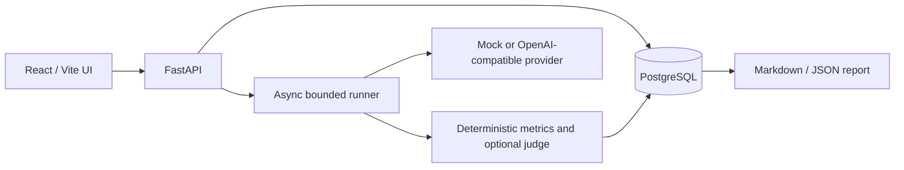

# Architecture

Each run contains a self-sufficient immutable JSON snapshot of the dataset version/hash and cases, model pricing and generation parameters, prompt text/version, retrieval settings, evaluator settings, git commit, timestamp, and exact matrix combinations. Case results, metric definitions, usage, cost, retrieved chunks, retries, raw provider results, and optional judge output are persisted separately.

The runner expands the full Cartesian product before execution, processes bounded batches asynchronously, applies bounded exponential backoff, persists every completed batch, and updates progress counters. On restart, stale runs are surfaced as failed or completed with errors instead of being silently replayed.

Mock mode is deterministic and default. Live adapters use the same `ProviderResponse` contract and require token usage to calculate cost. PostgreSQL is used in Docker; SQLite remains available for local unit work.
