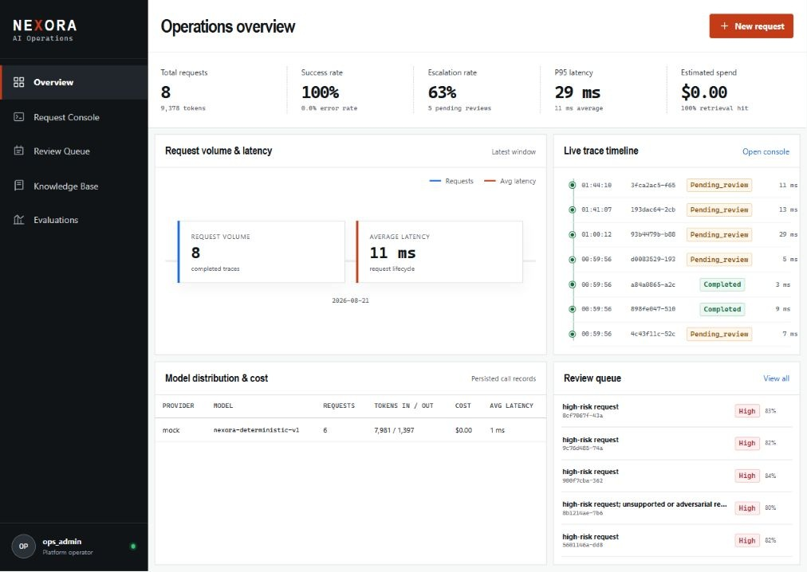
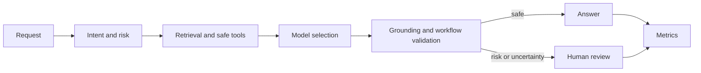
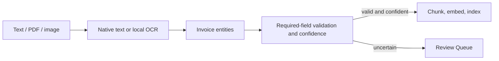

# Nexora AI Operations Platform

Production-oriented AI operations platform for grounded retrieval, model
routing, safe tool use, human review, document OCR, observability, and measurable
LLM quality.



Nexora uses a synthetic fintech-support domain and contains no real customer
data. Mock mode is the default, so the full application and evaluation suite can
be inspected without paid model access.

## What it demonstrates

- Request classification by intent, topic, risk, and evidence requirements.
- Semantic/hybrid RAG with citations and explicit missing/conflicting evidence.
- Cost-, quality-, or latency-aware routing with bounded provider fallback.
- Three schema-validated tools; no arbitrary shell or unrestricted HTTP.
- Human approval, rejection, and edit-and-approve workflows.
- Local OCR for scanned PDF, PNG, and JPEG invoices.
- Structured invoice entities, validation, confidence, and review routing.
- Persisted traces, provider attempts, tokens, cost, latency, and decisions.
- Separate 40-case regression and 30-case held-out evaluation splits.

## System flow



Document ingestion includes a narrow document-AI vertical slice:



See [architecture](docs/architecture.md) for boundaries and trade-offs.

## Evaluation protocol

The visible regression suite contains 40 development cases. A separate 30-case
held-out split adds unseen paraphrases, multilingual questions, indirect prompt
injection, knowledge gaps, conflicting evidence, tool policy, and high-risk
requests. Query expansion uses token-level domain vocabulary rather than exact
benchmark sentences.

Run the held-out split through the API:

```json
{
  "name": "Held-out comparison",
  "dataset": "held_out",
  "configurations": ["baseline", "improved"]
}
```

Historical `40/40` mock output remains versioned under `data/eval_results`, but
is explicitly regression evidence from a tuned, open dataset - not production
accuracy. Held-out and provider-backed results must be reported separately.
Metric definitions and interpretation are in [evaluation](docs/evaluation.md).

## Run locally

Requirements: Docker Desktop or Docker Engine with Compose v2.24+ and at least
4 GB of available memory.

```powershell
.\manage.ps1 Setup
# Replace POSTGRES_PASSWORD in .env with a long local value.
.\manage.ps1 Up
Invoke-RestMethod http://localhost:3000/api/v1/health
.\manage.ps1 Seed
```

- Operator UI: <http://localhost:3000>
- API schema: <http://localhost:3000/api/v1/docs>
- Health: <http://localhost:3000/api/v1/health>

Use `.\manage.ps1 SeedEval` to seed the demonstration corpus and run the
regression comparison. Use `.\manage.ps1 Down` to stop the stack without
deleting its PostgreSQL volume.

## Configure a model provider

Remote credentials are optional. Keep `NEXORA_AI_PROVIDER_MODE=mock` for offline
operation. For OpenAI or any OpenAI-compatible endpoint, create ignored
`.env.local` in the repository root:

```dotenv
OPENAI_API_KEY=replace-with-your-runtime-key
NEXORA_AI_PROVIDER_MODE=openai
NEXORA_OPENAI_BASE_URL=https://api.openai.com/v1
NEXORA_OPENAI_CHAT_MODEL=gpt-4.1-mini
NEXORA_OPENAI_EMBEDDING_MODEL=text-embedding-3-small
```

Replace the URL and model IDs with values supplied by the selected provider,
then run `.\manage.ps1 Up` again. Never commit keys to source, documentation,
frontend variables, screenshots, `.env.example`, or Git history.

## OCR invoice example

Upload a native or scanned invoice to `POST /api/v1/knowledge/documents`. The
response exposes `metadata.document_ai` with extraction method and confidence,
invoice number, date, currency, total, validation errors, entity confidence, and
`requires_human_review`. Low-confidence or invalid extraction creates a pending
item in the existing Review Queue.

The Docker backend installs Tesseract locally; uploaded document pixels are not
sent to an external OCR provider. This is a focused invoice workflow, not a
claim of universal layout understanding.

## Repository map

```text
backend/       FastAPI, SQLAlchemy, OCR/RAG, routing, tools, review, evaluation
frontend/      React operator dashboard
data/          Synthetic documents, regression/held-out cases, result artifacts
docs/          Architecture, evaluation, security, and API notes
infra/         PostgreSQL/pgvector initialization
```

Public documentation is intentionally limited to:

- [README](README.md)
- [Architecture](docs/architecture.md)
- [Evaluation](docs/evaluation.md)
- [Security](docs/security.md)
- [API](docs/api.md)

## Verification

```powershell
.\manage.ps1 Test
```

CI runs backend lint/tests, frontend tests/build, migration validation, and
container image builds. See [security](docs/security.md) for the deployment
boundary and [API](docs/api.md) for endpoint contracts.

## License

MIT. See [LICENSE](LICENSE).


