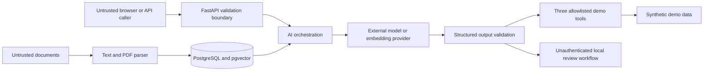

# Security policy and threat model

Nexora is a localhost-oriented portfolio demo that processes untrusted user messages, uploaded documents, retrieved text, provider output, and tool arguments. This document distinguishes controls implemented in the repository from hardening that is still required before public exposure or real customer data.

The current application has no authentication, user/account authorization, reviewer identity, or RBAC. Do not expose it publicly as-is.

## Reporting a vulnerability

Do not disclose a suspected vulnerability in a public issue. If the repository is hosted on GitHub, use **Security → Report a vulnerability** to open a private advisory. If private reporting is unavailable, use the maintainer's private contact channel.

Include the affected version or commit, reproducible steps, expected impact, and a suggested mitigation if available. Do not include real customer data, active API keys, or destructive proof-of-concept payloads. Receipt should be acknowledged within five business days; remediation timing depends on severity and exposure.

## Supported versions

Until the first tagged release, only the latest commit on `main` receives security fixes. Versioned release support will be documented after releases begin.

## Trust boundaries

Provider credentials are server-side environment values. The application does not intentionally place them in browser bundles, prompts, retrieved context, evaluation fixtures, or tool results. A dedicated secret-redaction test suite and production log review are not implemented, so this boundary has not been security-certified.

## Implemented controls and open production requirements

| Threat | Implemented now | Still required or recommended before production |
| --- | --- | --- |
| Prompt injection | Retrieved/tool text is labeled as data; direct injection rules; static tool allowlist; structured classifier validation; adversarial cases and direct tests | Indirect uploaded-document, encoded, multilingual, and independent red-team coverage; stronger semantic output validation |
| Data exfiltration | Synthetic customer fixtures; environment-only provider keys; obvious secret requests blocked; normal operational logs omit raw prompts | Authentication; account-scoped authorization; reviewer identity; output redaction/DLP; retention/deletion policy; cross-customer tests |
| Malicious upload | Extension and declared-MIME allowlists with agreement checks, basename sanitization, byte/decoded-text/chunk caps, UTF-8 checks, malformed-PDF rejection, 500-page PDF cap | File-signature and parser-time checks; parser isolation; upload authorization; malware/polyglot scanning |
| Tool abuse | Exactly three registered tools; strict Pydantic arguments; persisted calls; urgent synthetic tickets wait for review; no shell, dynamic code, SQL, or unrestricted HTTP tool | Caller/per-tool authorization, reviewer identity, idempotency, per-user quotas, and controls for real side effects |
| Model output injection | React escapes interpolated strings; malformed structured provider output fails or falls back; backend headers and a restrictive frontend CSP are present | Browser XSS/CSP tests; URL/Markdown sanitization if rich rendering is introduced |
| Sensitive-data leakage | Environment configuration, mock-by-default mode, synthetic fixtures, selected structured log fields, generic client errors | Central redaction, secret-shaped log/error tests, managed secret storage, retention policy, and production log review |
| Denial of service / runaway cost | Message/metadata/upload, decoded-text, chunk-count, and PDF-page limits; Top-K/output bounds; timeouts; bounded retries; single-process rate limit; cost telemetry | Distributed/gateway limits, authenticated upload/eval access, concurrency and job budgets, parser-time limits, context enforcement, cancellation, monitoring, and circuit breakers |
| Dependency or image compromise | Frontend lockfile with frozen CI install; minimal containers; backend runs non-root | Locked backend dependencies, automated dependency review, SBOM/signing, and dependency/container scanning; no such scan currently runs in CI |

## Current security invariants

- `.env`, `.env.local`, `secrets/`, database files, and cache directories are ignored by Git rules and excluded from Docker build contexts. This describes repository configuration; it is not proof about external Git history.
- Provider keys are read at runtime only. AI Prime Tech and OpenAI use separate
  secret names; `auto` falls back to mock when neither is configured, while
  explicit production provider mode fails closed without its key.
- Local Compose binds the frontend, backend, and PostgreSQL host ports to loopback. The data network is internal, and optional Redis has no host port.
- CORS uses an explicit allowlist and disables credentials. TrustedHost and backend security-header middleware are enabled.
- The nginx-served frontend sets a restrictive same-origin CSP plus `nosniff`, frame, referrer, and permissions headers. The FastAPI documentation route has a separate CDN-aware CSP.
- Tool names and arguments are selected from a static allowlist and validated. Arbitrary shell execution and unrestricted HTTP execution are outside the product boundary.
- Retrieved and uploaded content is placed in the prompt as untrusted data.
- High-risk, weak-evidence, unsupported, invalid-structure, and required-tool-failure paths can enter review. Generic source contradictions are not reliably detected.
- Review endpoints are a workflow mechanism, not an authorization boundary; they are unauthenticated in the demo.

## Upload validation boundary

The runtime validates allowed extensions and declared MIME values, requires their agreement, sanitizes the basename, limits bytes and decoded text, bounds generated chunk count, parses UTF-8 text/Markdown, rejects malformed or textless PDFs, and limits a PDF to 500 pages. It does not inspect file signatures or impose parser-time, malware, or polyglot checks. Those remain production requirements.

## Verification evidence

Automated tests currently cover direct prompt injection, strict tool schemas and allowlisting, high-risk and urgent-tool review flows, malformed provider output, provider timeout/fallback, traversal-style invalid extension, extension/MIME mismatch, invalid upload metadata, malformed PDF, explicit CORS/security headers, and the in-memory rate limiter.

The suite does **not** currently claim tests for authentication/RBAC, reviewer identity, account isolation, file signatures, parser-time/text/chunk limits, indirect document injection, secret-shaped log redaction, browser CSP/XSS behavior, dependency scanning, image scanning, or retention/deletion.

## Production deployment gate

Before public deployment or use with real data, add and verify TLS termination, authentication, account- and role-scoped authorization, managed secrets, additional upload hardening and isolation, distributed abuse controls, deployment-specific CSP, security monitoring, backup/restore, retention/deletion, dependency/container scanning, and independent security testing.

## Secret response procedure

If a secret is exposed, revoke and rotate it first, then remove it from the current tree and repository history, invalidate affected sessions, and review provider and application audit logs. Never rely on a follow-up commit alone to make a committed secret private.
