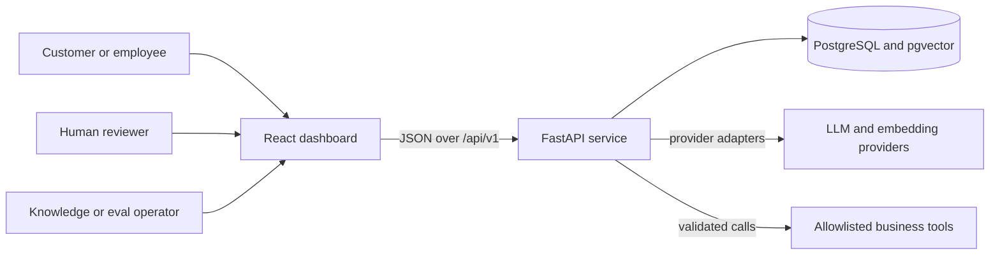
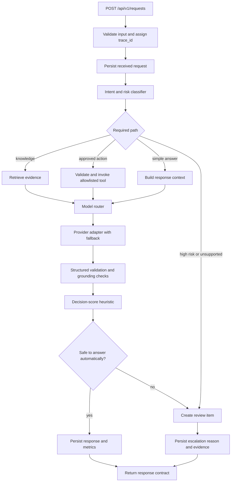
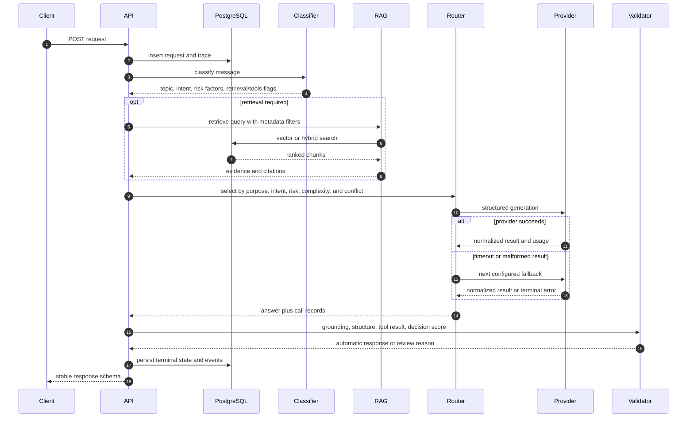
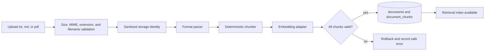
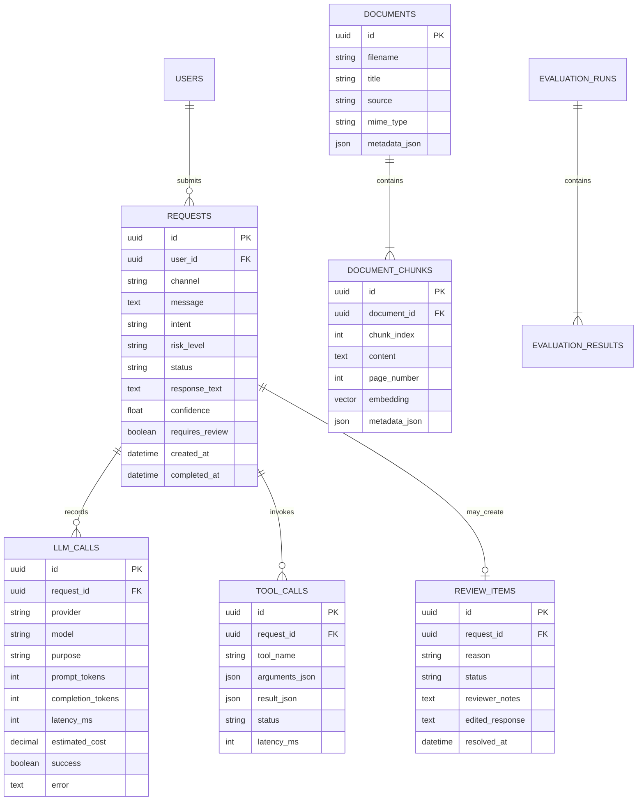

# Architecture

Nexora AI Operations Platform is designed as a production-oriented modular monolith: one FastAPI service owns the request workflow, while AI providers, retrieval, tools, review, evaluation, and persistence sit behind explicit interfaces. This document is the architecture contract. Runtime behavior remains authoritative and must be verified by tests and observable runs.

## System context

The browser never receives provider credentials and does not call a model or business tool directly. PostgreSQL is the system of record; pgvector is an extension of the same persistence boundary rather than a separate source of truth.

## Backend module boundaries

| Boundary | Responsibility | Must not do |
| --- | --- | --- |
| `app.api` | HTTP routing, authentication context, request/response schemas, status codes | Contain prompts, SQL, provider-specific parsing, or business decisions |
| `app.schemas` | Pydantic v2 transport and structured-output contracts | Perform I/O or hide validation failures |
| `app.services.ai` | Deterministic/LLM classification, model registry and routing, provider adapters, fallback | Write HTTP responses or call unregistered tools |
| `app.services.rag` | Parse, chunk, embed, retrieve, rank, and construct citations | Treat retrieved text as trusted instructions |
| `app.services.tools` | Allowlist, Pydantic argument validation, tool execution, normalized results | Execute arbitrary code, shell commands, SQL, or unrestricted HTTP |
| `app.services.observability` | Trace context, structured events, latency/token/cost records, metric aggregation | Log secrets or use telemetry failure to change the business outcome |
| `app.services.evaluation` | Dataset loading, configuration execution, metric calculation, persisted run results | Publish invented or manually edited benchmark values |
| `app.models` and `app.db` | SQLAlchemy mappings, sessions, transactions, repository concerns | Depend on FastAPI request objects or provider SDK response types |
| workflow/orchestration service | Coordinate classification, retrieval/tools, routing, validation, review, and completion | Bypass validation or make provider-specific decisions |

Dependencies point inward toward schemas and service interfaces. Provider SDK objects are converted to internal results inside adapters. Database rows are converted to domain/transport models before leaving the backend.

## Request processing flow

### Decision invariants

- Business `topic` (for example `card_security`) is independent from workflow
  `intent` and from `risk_level`; risk is never used as a topic label.
- `risk_level == high` always requires review, regardless of fluent model output.
- Missing evidence, incompatible current sources, invalid structured output, or a failed required tool prevents automatic completion.
- A tool call is possible only when its registered schema validates; a model-suggested tool name is not authority.
- Grounded paths may answer only from supplied evidence and must cite real retrieved chunks.
- “Confidence” is a workflow decision score, not a calibrated probability that the answer is true.
- Each provider attempt, fallback, retrieval, tool call, and terminal decision shares the same trace and request identifiers.

## Request sequence

## Knowledge ingestion flow

Parsing is a data boundary. Text such as “ignore previous instructions” remains quoted source content and never becomes a system or tool instruction. A document and its chunks become visible together; a partially embedded document is not retrieval-ready.

The document row stores normalized extracted content for full-document viewing.
Each chunk preserves `document_id`, title, source category, optional page
number, stable chunk index, content, embedding, character offsets/count, and
chunking metadata. The default chunker uses 900-character windows with
140-character overlap and prefers paragraph, sentence, then word boundaries.
Overlap prevents context loss at a boundary; hybrid retrieval combines 60%
semantic similarity and 40% keyword coverage. Citations are assembled from
persisted identifiers, not generated free-form by a model.

## Persistence model

Evaluation tables are deliberately separate from production request tables. A run stores its immutable configuration snapshot; each result stores the case ID, model, per-metric values, latency, estimated cost, pass state, and diagnostic details.

## Transaction and failure semantics

- Initial request persistence occurs before external AI work so a failure remains observable.
- Terminal request state and review creation are committed together where practical; duplicate review creation is prevented by request identity.
- Provider attempts and tool calls are recorded individually, including safe error categories. Secrets and raw credentials are never persisted.
- Provider timeout or malformed structured output moves through a bounded fallback chain. Exhaustion becomes a review/error outcome, not a fabricated answer.
- Ingestion uses one visibility boundary: failed parsing or embedding leaves no retrievable partial document.
- Evaluation failures are case results and do not erase earlier case results or rewrite benchmark history.

## Deployment topology

The required local topology is Docker Compose with frontend, backend, and PostgreSQL/pgvector containers. Redis may be introduced for rate limiting, caching, or background work, but the core request, review, and evaluation records remain durable in PostgreSQL. External paid providers are optional; the same service interfaces support a deterministic local/mock path for tests and demonstrations.

## Evolution rules

New providers, retrievers, or tools must implement an existing internal interface or introduce an explicit architecture decision. A feature is not documented as available until its API behavior, persistence, failure path, and test evidence exist.
