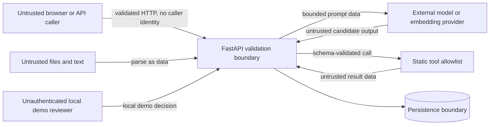

# Threat Model

This threat model covers the Nexora AI Operations Platform local demo and its synthetic data. It treats user input, uploaded and retrieved content, model output, tool results, and metadata as untrusted. The controls below are split between what the repository implements now and what a public or real-data deployment would still require.

The demo is not a bank core, payment processor, regulatory decision system, or security-reviewed production service. In particular, it has no user authentication, reviewer identity, role-based authorization, or account-scoped access control.

## Scope and security objectives

In scope are the React client, FastAPI API, PostgreSQL/pgvector, document ingestion, retrieval and prompt construction, provider adapters, three synthetic demo tools, the review workflow, observability, and evaluation execution.

Current objectives are to:

1. keep provider credentials out of browser code, prompts, retrieved context, and normal application logs;
2. prevent untrusted text from expanding the static tool allowlist or becoming executable code;
3. preserve request, citation, tool, review, and evaluation records;
4. bound common request, upload, provider, and retry costs; and
5. fail toward a safe response or review when evidence, structured output, or an allowlisted tool is insufficient.

Identity-based confidentiality and authorization are production requirements, not current demo guarantees.

## Assets

- Provider API keys, database credentials, and deployment configuration.
- Synthetic customer records and any future account-scoped data.
- System/developer prompts and security policy.
- Knowledge documents, chunks, embeddings, and citation metadata.
- Tool authority and tool arguments.
- Request, LLM-call, tool-call, review, and evaluation records.
- Service availability and cost budget.

## Trust boundaries

Parsing or schema validation proves shape, not caller identity, authorization, truth, or semantic safety.

## Threat actors and assumptions

- Any caller can invoke every current API endpoint; the application does not authenticate users or reviewers.
- An uploaded document may contain prompt-injection text, oversized content, malformed parser input, or misleading policy claims.
- A provider may time out, return malformed output, expose unexpected text, or follow malicious context.
- A tool result may be stale or adversarial text even though the demo implementations are local and synthetic.
- An operator may misconfigure CORS, model limits, prices, credentials, or public network exposure.
- Localhost binding and synthetic data reduce exposure for the portfolio demo but are not production controls.

## Threats, implemented controls, and production gaps

| Threat | Implemented in this repository | Not implemented; required or recommended before public deployment |
| --- | --- | --- |
| Prompt injection | Direct phrase rules; retrieved/tool content is labeled untrusted data in the prompt; static tool allowlist; Pydantic parsing for classifier output; adversarial cases and direct-injection tests | Broader indirect, encoded, and multilingual testing; independent red-team set; stronger output policy validation; generic semantic conflict detection |
| Data exfiltration | Keys come from server environment configuration; normal structured request logs omit prompts and environment values; demo customer data is synthetic; obvious credential requests are blocked | Authentication, account-scoped authorization, reviewer identity, output DLP/redaction, cross-customer access tests, and a retention policy |
| Malicious upload | `.txt`, `.md`, and `.pdf` extension allowlist; declared-MIME allowlist and extension/MIME agreement; basename sanitization; byte, decoded-text, chunk-count, and 500-page ceilings; UTF-8 validation; malformed-PDF rejection; uploaded content is never executed | Upload authorization; content-signature checks; polyglot detection; processing-time ceilings; parser isolation; malware scanning |
| Tool abuse | Exactly three registered tools; strict Pydantic arguments with extra fields forbidden; bounded strings/enums; urgent synthetic ticket execution waits for review; every attempted call is persisted; no dynamic import, shell, SQL, or unrestricted HTTP tool | User and per-tool authorization, idempotency, per-user quotas, approval identity, distributed rate limiting, and policy tests for real side effects |
| Model output injection | React renders returned strings as escaped text; structured classifier output is validated; malformed provider responses fail or fall back; frontend nginx sends a restrictive CSP | Explicit URL/Markdown sanitization if rich rendering is added; browser XSS/CSP regression tests |
| Sensitive-data leakage | Environment-only, provider-specific key names; automatic local fallback when no remote key exists; synthetic fixtures; structured logs use selected fields; provider errors are normalized before client responses | A general-purpose redaction layer; secret-shaped log/error tests; log export review; retention/deletion policy; managed secret storage |
| Denial of service | Message, metadata, upload-byte, decoded-text, chunk-count, and 500-page limits; Top-K and output-token bounds; provider timeout and bounded retries; single-process IP rate limit; list pagination limits | Gateway/distributed limits; authenticated eval/upload access; concurrency and job budgets; parser-time ceilings; cancellation and resource monitoring |
| Runaway token cost | Bounded output tokens, limited retrieved chunks, provider timeout/retry cap, model routing, and persisted estimated cost | Enforce the selected model's `max_context` against the assembled prompt; per-request/eval budgets; circuit breakers; provider billing reconciliation and alerts |
| Citation forgery or unsupported claims | Runtime citation objects are constructed from retrieved persisted chunks rather than generated free-form | Independent citation-to-database validation at the evaluation boundary; semantic claim-support/contradiction analysis; generic conflict detection |
| Knowledge poisoning | Checksums, source/title metadata, and an auditable document/chunk relationship are stored; the synthetic corpus contains known conflicts | Authenticated uploaders, provenance/version policy, immutable audit history, approval workflow, rollback, and contradiction monitoring |
| Review tampering | Original and edited responses, notes, status, timestamps, and request linkage are persisted | Reviewer authentication, authorization, identity attribution, assignment rules, immutable decision audit, and CSRF/session controls if cookies are used |
| CORS/browser abuse | Explicit CORS origins, no credentialed CORS, TrustedHost middleware, backend security headers, and nginx CSP/frame/referrer/permissions headers | Deployment-specific origin/host/CSP policy, TLS, authentication, and CSRF protection when applicable |
| Dependency or image compromise | Frontend uses a lockfile and frozen install in CI; images are minimal and backend runs as a non-root user | A locked backend dependency set, automated dependency review, SBOM/signing, and dependency/container scanning; these scans do not currently run in CI |

## Current runtime controls

### HTTP and messages

- Pydantic validates request fields, channels, priorities, and structured classifier output.
- The API bounds message and metadata sizes.
- The server assigns a trace ID when the supplied value is missing or invalid. A caller-supplied ASCII value of at most 64 characters is accepted for correlation, so it must not be treated as an authenticated identity.
- Provider response bodies and stack traces are not returned to clients.
- There is no endpoint authentication or authorization.

### Uploads

- The API validates the filename extension and declared MIME against allowlists, requires their agreement, sanitizes the basename, bounds uploaded bytes, decoded text, and generated chunk count, and parses only text/Markdown/PDF.
- The PDF parser rejects malformed or textless files and caps a PDF at 500 pages.
- The application does **not** inspect file signatures or impose a parsing-time ceiling.
- Documents are stored in the database under generated IDs; the original sanitized filename is metadata, not a filesystem storage path.

### LLM providers

- Keys load from environment configuration and are sent only in provider authorization headers.
- Output tokens, provider timeout, and retries are bounded.
- Classifier output is parsed through a Pydantic schema; invalid structured output falls back conservatively and is reflected in the confidence heuristic.
- The registry's `max_context` field is descriptive; the assembled prompt is not currently checked against it as an exact token budget.

### Tools and review

Only `get_customer_summary`, `create_support_ticket`, and `get_service_status` are registered. Each call has a Pydantic schema and a persisted record. Urgent synthetic ticket creation pauses for review; the other demo calls do not require approval. No model-supplied URL, module, command, or SQL statement is executable.

Review is a workflow safety gate, not an authorization boundary. The local demo review endpoints are unauthenticated and do not record reviewer identity. High risk, weak evidence, unsupported requests, invalid structured output, required-tool failure, and the classifier's recognized conflict patterns can create a review item. Generic contradictions between retrieved sources are not currently detected reliably.

### Frontend

- React text interpolation escapes answer, citation, and tool-result strings; the code does not use `dangerouslySetInnerHTML` for those values.
- Backend responses and nginx add `nosniff`, frame, referrer, and permissions headers.
- The FastAPI documentation route receives a CDN-aware dedicated CSP. The nginx-served React application receives a restrictive same-origin CSP.
- Provider credentials are not part of the frontend API contract or public build-time configuration.

## Detection and audit

The runtime persists request/trace IDs, classifier outcome, selected model and route reason, token/cost/latency values, retrieval and tool timings, citation identifiers/scores, tool name/status, escalation reason, and review decisions. Application logs emit selected operational fields rather than raw request prompts.

There is no dedicated security-event pipeline, credential redaction framework, reviewer identity log, or tested retention policy. Repeated injection phrases, cross-customer attempts, upload rejections, rate-limit events, schema failures, and unusual cost should become explicit alerts before a public deployment.

## Verification evidence and known test gaps

Currently exercised by automated tests:

- direct prompt-injection refusal and escalation;
- malformed provider output, provider timeout, and fallback;
- strict tool argument schemas and the three-tool allowlist;
- high-risk review plus urgent-tool approval;
- invalid extension/traversal-style filename, invalid metadata, and malformed PDF rejection;
- explicit CORS response, core security headers, rate limiting, and safe health failures.

Not currently claimed as tested:

- authentication, authorization, reviewer identity, or cross-customer access boundaries;
- file signatures, parser timeout, malware, or polyglot handling;
- indirect uploaded-document injection, encoded/multilingual attacks, or semantic conflict detection;
- secret-shaped log redaction, browser XSS regression, or data-retention deletion;
- dependency, SBOM, or container vulnerability scanning.

## Production deployment gate

Do not expose this demo publicly or connect it to real customer data until authentication and authorization, TLS, managed secrets, additional upload hardening, distributed abuse controls, deployment-specific CSP review, security monitoring, backup/restore, retention/deletion, dependency scanning, and an independent security test have been added and verified.

## Incident response outline

On suspected leakage or tool abuse: disable the affected provider/tool, preserve only appropriately redacted records, rotate exposed credentials outside the repository, identify affected traces, correct the authorization or prompt boundary, add a regression test/eval case, and only then re-enable the path. Never paste a replacement secret into an issue, chat transcript, or benchmark artifact.
