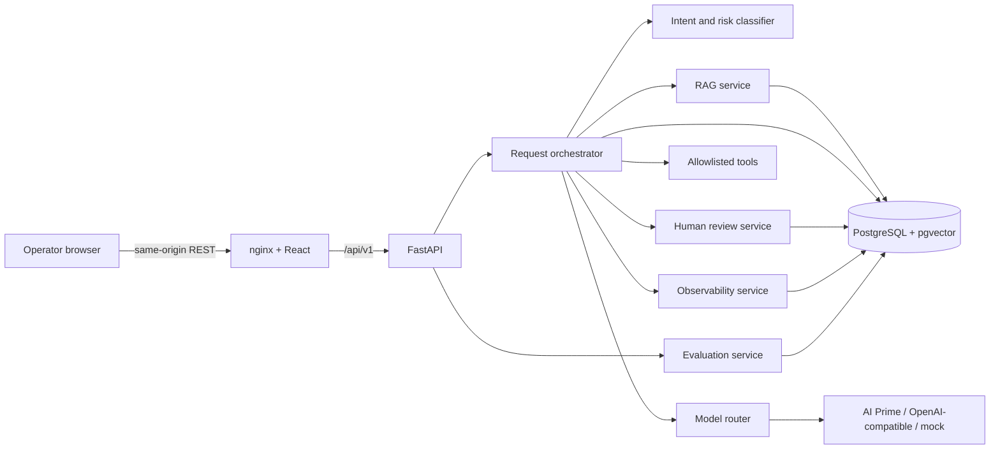
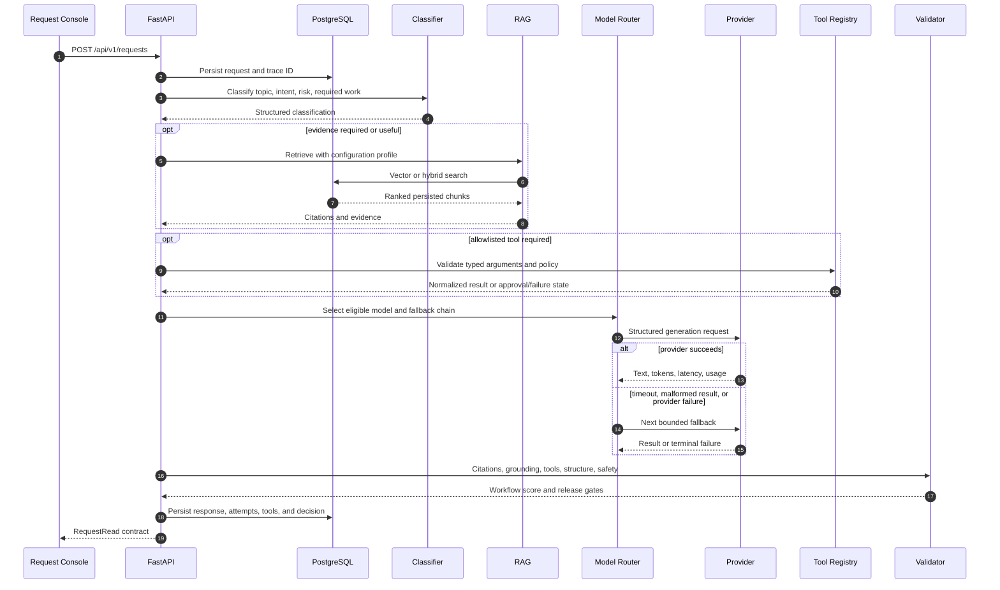
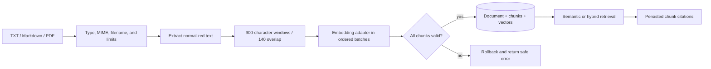
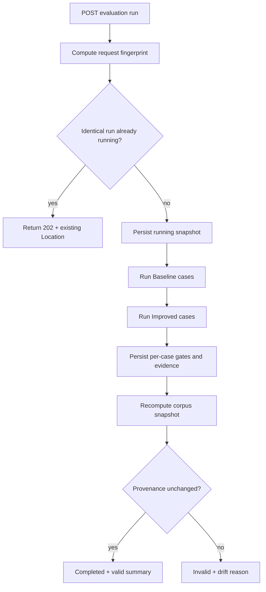

# Architecture and Processes

## Architectural style

Nexora is a modular monolith: one FastAPI deployment coordinates classification, retrieval, model routing, provider execution, tools, validation, review, metrics, and evaluation. PostgreSQL is the system of record; pgvector stores embeddings inside the same transaction boundary. React/Vite provides the operator UI and nginx proxies `/api/v1` to the backend.

This shape keeps the portfolio system reproducible while preserving explicit internal boundaries that can later be extracted into workers or services.

The browser never receives provider credentials and never calls a model or business tool directly.

## Module boundaries

| Module | Responsibility |
| --- | --- |
| `backend/app/api` | HTTP routing, validation boundary, status codes, and response serialization. |
| `backend/app/schemas` | Pydantic transport contracts and structured values. |
| `backend/app/services/ai` | Classification, model registry, routing, provider adapters, and fallback. |
| `backend/app/services/rag` | Parsing, chunking, embedding, retrieval, ranking, and citations. |
| `backend/app/services/tools` | Static tool registry, argument validation, execution, and normalized results. |
| `backend/app/services/review_service.py` | Review decisions, conflict handling, and decision history. |
| `backend/app/services/observability` | Trace, latency, token, cost, and aggregate metric calculations. |
| `backend/app/services/evaluation` | Dataset execution, gates, summaries, provenance, and persisted results. |
| `backend/app/models` / `db` | SQLAlchemy entities, sessions, migrations, and transactions. |
| `frontend/src/pages` | Five operator workflows. |
| `frontend/src/components` | Shared UI, safe Markdown presentation, source reader, and application shell. |

## Request lifecycle

### Classification

The classifier separates three concepts:

- **topic** — business subject such as card security or account access;
- **intent** — workflow class such as internal policy, data lookup, or high risk;
- **risk** — low, medium, or high operational impact.

Obvious safety, tool, and high-risk patterns use deterministic rules. Ambiguous language can use a provider-backed structured classifier. A malformed structured result fails or falls back; it is not silently accepted.

Supported intents are `general_knowledge`, `internal_policy`, `account_or_customer_action`, `data_lookup`, `high_risk`, and `unsupported`.

### Model routing

The model is selected after classification. The router evaluates:

- required capabilities;
- intent and risk;
- deterministic complexity;
- source conflict signals;
- configured strategy;
- enabled/available registry entries;
- minimum quality tier.

| Strategy | Selection rule |
| --- | --- |
| `cheapest_adequate` | Lowest configured cost at or above the required tier. |
| `quality_first` | Strongest eligible configured model. |
| `latency_first` | Lowest expected latency among eligible models. |
| `explicit_model` | Requested model unless safety or availability requires an override. |
| `fallback_chain` | Ordered bounded chain until an eligible attempt succeeds. |

The configured AI Prime roles are Fable for fast/simple tasks, Sonnet for routine grounded workflows, and Opus for high-risk or complex work. The local deterministic model is a fallback tier, not a false equivalent to remote quality.

Every provider attempt stores provider, model, purpose, route reason, tokens, latency, configured cost estimate, retry count, success, and safe error category.

### Response formatting

Provider text is normalized before persistence:

- null bytes and internal untrusted-data boundary tags are removed;
- impossible numeric citation markers are removed;
- a valid source footer is added when required;
- residual Markdown tables from weak providers are converted to readable prose;
- model-authored `**` and `__` emphasis markers are removed from persisted answers.

The frontend safely renders remaining structural Markdown—headings, lists, quotes, code, and tables—through React elements without injecting model-authored HTML.

## RAG and knowledge ingestion

### Upload boundary

- Accepted: `.txt`, `.md`, and `.pdf` with matching declared MIME.
- Maximum transport size: 100 MiB.
- Maximum decoded text: 20 million characters.
- Maximum PDF length: 500 pages.
- Maximum indexed chunks: 25,000.
- Default embedding batch size: 64.

Filenames are reduced to safe basenames. Malformed, mismatched, empty, or excessive uploads are rejected. A document becomes visible only after the complete transaction succeeds.

### Chunk and citation contract

Each chunk stores document ID, stable chunk ID/index, title, source, optional page number, content, embedding, offsets/counts, and metadata. Citations are created from those persisted rows rather than free-form model text.

The improved retriever blends 60% semantic similarity and 40% deterministic keyword coverage, adds domain query expansion, and may retrieve evidence opportunistically for tool requests. The baseline uses semantic similarity only.

Retrieved documents and tool output are always untrusted data. They cannot modify tool authority, system policy, or provider credentials.

### Embedding modes

- `mock` and `auto` preserve one stable `local-hash` embedding space, including during provider outages.
- explicit `openai` mode can use a configured OpenAI-compatible embedding provider.
- changing the embedding space requires a complete corpus re-index; vectors from different spaces must not be mixed.

## Safe tools

Exactly three tools are registered:

| Tool | Purpose | Side-effect boundary |
| --- | --- | --- |
| `get_customer_summary(customer_id)` | Reads an allowlisted synthetic customer summary. | Read-only synthetic data. |
| `create_support_ticket(title, description, priority)` | Creates a synthetic support-ticket record. | Typed action; urgent cases can require review. |
| `get_service_status(service_name)` | Reads a current synthetic service state. | Only canonical service names are accepted. |

Pydantic validates every argument. There is no arbitrary shell, SQL, dynamic code, or unrestricted HTTP executor.

## Validation and human review

The final workflow score combines retrieval evidence, citation coverage, answer validation, structured-output validity, tool outcome, and self-check signals. It is a decision heuristic—not a calibrated probability of truth.

Automatic release is blocked by any applicable gate, including:

- high risk;
- score below the configured threshold;
- missing or weak required evidence;
- source conflict requiring authority;
- unsupported/adversarial request;
- invalid structured output or citation markers;
- failed required tool;
- model quality below the required tier.

Review creation and terminal request state are persisted together where practical. A review record preserves the original request/response, citations, reasons, classification, route, score components, timestamps, notes, edited response, and decision history.

## Observability

One trace ID connects:

- the request lifecycle;
- classification and route reasoning;
- retrieval and tool timing;
- every provider attempt;
- token use and estimated cost;
- validation and review state.

The Overview aggregates operational traffic only. Evaluation-tagged requests are intentionally excluded from the operational KPI and review-queue views.

Telemetry failure must not change a business decision, and credentials are never part of persisted event contracts.

## Evaluation lifecycle

An evaluation run snapshots the dataset, evaluator, pipeline files, knowledge corpus/chunks, embeddings, runtime settings, routing strategy, model registry, and price configuration. It processes configurations sequentially and cases in dataset order through the real request service.

Knowledge upload/delete is locked while the in-process evaluation snapshot is active. Startup marks abandoned `running` rows failed because the current synchronous runner cannot survive a container restart.

## Failure semantics

- Request input is persisted before external provider work so failures remain observable.
- Provider timeout or malformed output advances through a bounded fallback chain.
- Exhausted generation becomes review/error, never a fabricated successful answer.
- Failed ingestion creates no partially retrievable document.
- Review decisions use conflict detection and recoverable failure states.
- Evaluation case failures remain stored and do not erase earlier results.
- Provider cost is estimated from registry values; external billing is authoritative.

## Evolution path

Production scaling would add durable background jobs, distributed rate limiting, immutable corpus versions, provider circuit breakers, OpenTelemetry export, authentication/RBAC, and separate analytical/vector workloads where justified. New providers and tools must enter through an explicit interface, schema, failure path, audit record, and tests.
