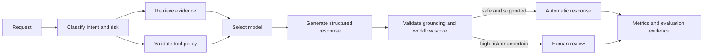

# Nexora AI Operations Platform — Final Documentation

Nexora is a production-oriented AI operations platform for retrieval-augmented generation (RAG), model routing, tool-enabled automation, human review, observability, and measurable LLM quality.

This directory is the final, GitHub-ready documentation set. It describes the behavior implemented in the repository and verified against the running local stack. It does not present the localhost portfolio application as a hardened public production service.


## Documentation map

| Document | Purpose |
| --- | --- |
| [Quick Start](QUICK_START.md) | Minimal prerequisites, startup commands, URLs, and shutdown command. |
| [Product Guide](PRODUCT_GUIDE.md) | Complete walkthrough of every dashboard section, control, and operator workflow. |
| [Architecture and Processes](ARCHITECTURE_AND_PROCESSES.md) | System boundaries, request lifecycle, routing, RAG, tools, review, observability, and evaluation flows. |
| [API Reference](API_REFERENCE.md) | REST endpoints, payloads, response contracts, pagination, and error behavior. |
| [Evaluation and Benchmarks](EVALUATION_AND_BENCHMARKS.md) | Dataset, baseline/improved protocol, pass gates, metrics, provenance, and current persisted results. |
| [Operations, Security, and Release](OPERATIONS_SECURITY_AND_RELEASE.md) | Setup, provider modes, runbooks, verification, security limits, and GitHub publishing checklist. |

The repository also contains the implementation-level [architecture contract](../docs/architecture.md), [evaluation methodology](../docs/evaluation.md), [architecture decisions](../docs/decisions.md), and [security policy](../SECURITY.md).

## Product at a glance

The platform receives a request and coordinates the following stages:



The operator UI contains five sections:

1. **Overview** — operational KPIs, traces, model use, cost, and review backlog.
2. **Request Console** — request submission and stage-by-stage pipeline evidence.
3. **Review Queue** — auditable approve, edit-and-approve, and reject decisions.
4. **Knowledge Base** — atomic document ingestion, metadata, content, and chunk inspection.
5. **Evaluations** — persisted baseline/improved comparisons and per-case evidence.

## Verified local snapshot

The values below were read from the running stack on **2026-08-26**. They are a point-in-time development snapshot, not an SLA or production claim.

| Signal | Verified value |
| --- | ---: |
| API health | `ok` |
| Database | `ok` |
| Provider mode | `aiprimetech` |
| Provider health meaning | `configured_unverified` |
| Operational requests | 26 |
| Successful operational requests | 26 |
| Pending reviews | 20 |
| Persisted operational tokens | 44,495 |
| Estimated operational spend | $0.070758 |
| Indexed documents / chunks | 6 / 32 |
| Current evaluation dataset | Fintech support v1, 40 cases |
| Selected persisted run | Synthetic benchmark v6, 80 results |
| Evaluation provenance | Valid at completion |

`configured_unverified` is intentional: the health endpoint verifies configuration without transmitting credentials to an external provider. Model catalog entries are configured routes, not a continuous live availability check.

## Repository status

The implementation satisfies the project specification's local portfolio definition of done:

- Docker Compose starts frontend, backend, and PostgreSQL/pgvector.
- Knowledge documents can be uploaded, inspected, searched, filtered, and deleted.
- Requests pass through intent/risk classification, retrieval, routing, generation, validation, and optional review.
- Three schema-validated demo tools are implemented.
- High-risk and uncertain cases enter an auditable review queue.
- Request, model, token, latency, cost, retrieval, and escalation metrics are visible.
- The 40-case evaluation suite runs the actual pipeline and stores result evidence.
- Backend lint/tests, frontend tests/typecheck/build, and Docker image builds have passed locally.
- CI configuration exists under `.github/workflows/ci.yml`.
- Secrets are runtime-only and ignored by repository rules.

The project is initialized as a Git repository on the `main` branch. The workflow configuration has been verified locally; the public repository's GitHub Actions run should be checked after each push.

## Quick start

### Prerequisites

- Docker Desktop or Docker Engine with Docker Compose v2.24+
- At least 4 GB of free memory
- PowerShell 7 for the provided management script
- Optional for local development: Python 3.12+, Node.js 22+, and pnpm 11.19

### Start in deterministic local mode

```powershell
.\manage.ps1 Setup
.\manage.ps1 Up
.\manage.ps1 Seed
Invoke-RestMethod http://localhost:3000/api/v1/health
```

Open:

- Dashboard: <http://localhost:3000>
- API documentation: <http://localhost:3000/api/v1/docs>
- Direct backend health: <http://localhost:8001/api/v1/health>

Run and persist the complete baseline/improved comparison:

```powershell
.\manage.ps1 SeedEval
```

Stop the stack while preserving the database volume:

```powershell
.\manage.ps1 Down
```

## Demonstration sequence

1. Open **Knowledge Base** and confirm that the six synthetic fintech documents are indexed.
2. Open **Request Console** and ask: `How long does card replacement take?`
3. Inspect the classified intent, selected model, evidence, citations, workflow score, tokens, latency, and estimated cost.
4. Submit: `Customer CUST-1002 says their card is stolen. What should we do?`
5. Confirm that the strongest configured reasoning tier is selected and the high-risk gate requires human review.
6. Open **Review Queue**, inspect the original request, editable response, citations, escalation evidence, and decision history.
7. Submit a support-ticket request and inspect the validated tool call.
8. Submit a prompt-injection request and confirm that hidden instructions are not disclosed.
9. Ask about information absent from the corpus and confirm an unavailable/uncertain outcome instead of a fabricated policy.
10. Open **Evaluations**, compare Baseline and Improved, and inspect the persisted cases and provenance record.

## Scope and honest limitations

- The application is a localhost-oriented portfolio system using synthetic data.
- It currently has no authentication, reviewer identity, account authorization, or RBAC.
- The local/default deterministic evaluation is a regression test, not an independent provider benchmark.
- Current AI Prime mode uses the stable local hash embedding space; explicit OpenAI mode can use OpenAI-compatible embeddings. Changing embedding space requires re-indexing the corpus.
- Provider cost is estimated from configured registry prices; provider billing remains authoritative.
- Public deployment requires TLS, managed secrets, authorization, distributed abuse controls, backups, retention controls, security monitoring, scanning, and independent testing.

See [Operations, Security, and Release](OPERATIONS_SECURITY_AND_RELEASE.md) before publishing or deploying the repository.
